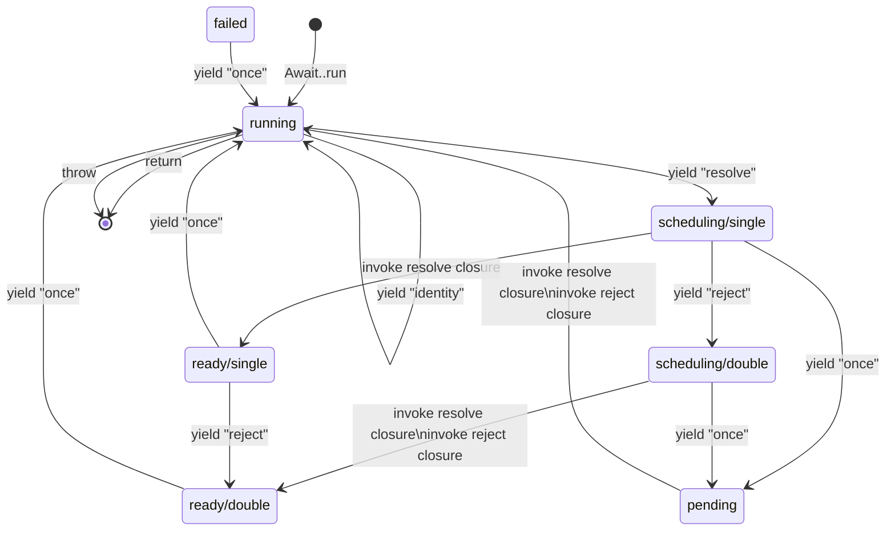

# await-rt
await-rt is the low-level runtime of the [await-generator][lib-repo] library.
See the await-generator repo or the [book][book] for beginner-level introduction.

## Specification
await-rt executes generators that conform to the await-generator protocol:

1. The state transition of a generator:
  1. A generator must not start executing until it is passed to `Await::run()`.
  2. When passed to `Await::run()`,
    the generator enters the *running* state.
    It immediately rewinds and synchronously executes until its first suspension point.
    The control flow will be returned to the caller of `Await::run()` *eventually*.
  3. When a generator in *running* state suspends with the string `"identity"`,
    it is synchronously resumed with an object of arbitrary class
    unique to the `Await::run()` call that rewinded the generator.
  3. When a generator in *running* state suspends with the string `"resolve"`,
    it is synchronously resumed with a "resolve closure" of type `Closure(value=): void`.
    The generator state changes to *scheduling/single*.
  4. When a generator in *scheduling/single* state
    suspends with the string `"reject"`,
    it is synchronously resumed with a "reject closure" of type `Closure(Throwable): void`.
    The generator state changes to *scheduling/double*.
  5. When a generator in *scheduling/single* or *scheduling/double* state suspends with the string `"once"`,
    the generator state changes to *pending* and is not actively resumed.
  6. When a generator is in *scheduling/single* or *scheduling/double* state
    and the resolve closure is invoked,
    the generator state changes to *ready/single* or *ready/double*.
    Since the generator is supposed to be executing in the scheduling state,
    the closure returns normally, returning the control flow to the generator.
  7. When a generator is in *scheduling/double* state and the reject closure is invoked,
    the generator state changes to *failed*.
    Since the generator is supposed to be executing in the scheduling state,
    the closure returns normally, returning the control flow to the generator.
  8. When a generator is in *ready/single* or *ready/double* state and suspends with the string `"once"`,
    the generator state changes to *running*,
    and the generator is synchronously resumed with
    the value previously passed to the resolve closure (or null if none passed).
  9. When a generator is in *failed* state and suspends with the string `"once"`,
    the generator state changes to *running*,
    and the generator is synchronously interrupted with
    the throwable value previously passed to the reject closure.
    This is effectively the same as replacing `yield "once"` with `throw $throwable`.
  10. When a generator is in *pending* state and the resolve closure is invoked,
    the generator is synchronously resumed with the value passed (or null if none passed).
    The control flow will be returned to the caller of the resolve closure *eventually*.
  11. When a generator is in *pending* state and the reject closure is invoked,
    the generator is synchronously interrupted with the value passed (or null if none passed).
    The control flow will be returned to the caller of the reject closure *eventually*.
    no earlier than the next time the generatoe enters *pending*, *return* or *throw* state,
    but the exact moment is undefined.
  12. When a generator is in *runnning* state and returns from the generator,
    control flow is returned to the *eventual rewinds*.
  13. When a generator is in *runnning* state and throws out of the generator,
    control flow is returned to the *eventual rewinds* with an active exception throwing.
    - Note: This is different from await-generator v3,
      where the exeption would be wrapped with an `AwaitException` instead.
2. All state transitions not specified above
  results in throwing an exception of an arbitrary type that extends or equals `\Exception`.
3. Calling a resolve closure after the generator is resumed to the *running* state
  results in throwing an exception of an arbitrary type that extends or equals `\Exception`.
4. The terms *eventually* or *eventual rewinds* refer to the following:
  When the control flow is passed into the await runtime,
  i.e. through calling `Await::run`, resolve closure or reject closure,
  the exact moment or order that the control flow is returned to the caller is undefined,
  but is guaranteed to take place eventually provided that
  the generator does not actively trigger any code that blocks indefinitely.
  However, it is guaranteed that, if there are no other callers,
  if the generator enters *running* state and then *return* or *throw* immediately,
  the control flow is immediately returned to the caller.

[lib-repo]: https://github.com/SOF3/await-generator
[book]: https://sof3.github.io/await-generator/master
